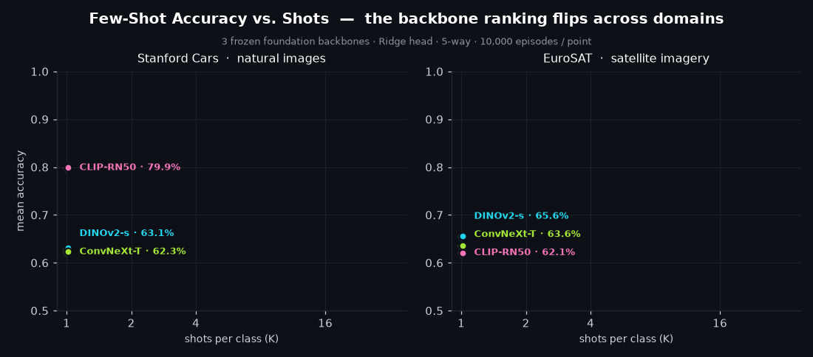

<div align="center">

# 🛰️ Few-Shot Classification with Frozen Foundation Models

### Benchmarking DINOv2 · CLIP · ConvNeXt across 3 classifier heads, 2 domains, and 4 shot settings

<p>
  
  
  
  
  
</p>
<p>
  
  
  
</p>

<br/>



</div>

---

## Overview

How well do **frozen** pre-trained vision backbones generalize to brand-new classes from just a
handful of labeled examples? This project answers that empirically. It runs a complete few-shot
benchmark — **3 backbones × 3 classifier heads × 2 datasets × 4 shot settings = 72 configurations** —
at the **full C-way setting** (196-way for Stanford Cars, 10-way for EuroSAT), plus an **N-way
analysis** that sweeps the way-count down to 5. For Task 5 it tries three ways to beat the baselines:
per-episode **λ-tuned Ridge**, a richer **Mahalanobis** head, and a small-N **CLIP-Adapter**.

<table>
<tr><td>

**Backbones** (frozen feature extractors)
- `DINOv2-small` — self-supervised ViT (Meta)
- `CLIP-RN50` — image-text contrastive (OpenAI)
- `ConvNeXt-Tiny` — ImageNet-supervised CNN

</td><td>

**Classifier heads** (fit per episode)
- Prototypical — nearest class-mean
- Ridge Regression — closed-form, regularized
- Linear Probing — `nn.Linear` + Adam

</td></tr>
</table>

**Datasets:** Stanford Cars (196 fine-grained classes, natural images) · EuroSAT (10 classes,
satellite imagery — a deliberate domain shift). **Episodes:** full C-way (196-way Cars / 10-way
EuroSAT), K ∈ {1, 2, 4, 16} shots, 15 queries/class (Cars 2,000 episodes, EuroSAT 10,000).

## 🔑 Key findings

> **1. Ridge is the strongest baseline head, and the Linear probe collapses at high-way.** At 196-way
> a 196-output linear layer overfits a few shots badly, while Ridge and Prototypical hold up far better.

> **2. A richer closed-form head wins, and the win grows with the way-count.** Our shrinkage
> **Mahalanobis** head beats the best baseline on Stanford Cars at K≥2, by up to **+10.6 pts** at
> 196-way, while per-episode λ-tuning and a learned CLIP-Adapter do not. The bottleneck is *data*, not capacity.

> **3. Backbone quality is domain-relative.** Read at matched N, CLIP-RN50 is best on natural-image
> Cars and worst on satellite EuroSAT, while DINOv2 transfers more evenly — pretraining distribution
> matters more than architecture. Its zero-shot text baseline shows the same split, and feature
> clusterability tracks downstream accuracy at **r = 0.90**.

#### Best accuracy per backbone (K=16, Mahalanobis head)

| Backbone | Cars (196-way) | EuroSAT (10-way) |
|---|:---:|:---:|
| **CLIP-RN50** | **73.3%** 🥇 | 84.1% |
| **DINOv2-small** | 70.0% | **86.7%** 🥇 |
| **ConvNeXt-Tiny** | 48.0% | 84.6% |

Chance is 0.5% at 196-way and 10% at 10-way. The two columns are **not** directly comparable (N
differs) — see the matched-N comparison in the notebook.

## How it works

```
Section 1 — Feature Extraction        Section 2 — Benchmarking
┌───────────────────────────┐         ┌────────────────────────────────────┐
│ images → frozen backbone  │   .pt   │ sample C-way K-shot episode        │
│ → cache embeddings to disk│ ──────▶ │ → fit head on support              │
│   (6 cache files, ~350 MB)│         │ → score 15 queries/class           │
└───────────────────────────┘         │ → mean over 2k–10k episodes        │
                                       └────────────────────────────────────┘
```

The sweep is **vectorized across episodes** (a batched solve instead of a Python loop), verified
bit-identical to the reference per-episode heads, with memory-aware batching for the ~40× larger
196-way episodes. The full C-way regeneration (main benchmark + Task-5 closed-form + the N-way sweep +
extras) takes roughly **1–1.5 h** on one GPU, dominated by the 196-way Cars runs; re-rendering the
analysis from the cached results is about a minute.

## Repo layout

```
cv_hw2_312359284_314884834.ipynb   self-contained, executed report (all results embedded)
benchmark_results.csv               72 C-way baseline configs (mean / std accuracy)
improved_results.csv                48 LOO-Ridge + Mahalanobis configs, C-way (Task 5)
nway_results.csv                    N-way ProtoNet sweep + cosine ablation (Task 4f)
zeroshot_results.csv                CLIP zero-shot text baseline (Task 4f)
cluster_results.csv                 feature silhouette / clusterability (Task 4f)
paired_results.csv                  paired significance test (Task 4f)
adapter_results.csv                 24 CLIP-Adapter configs, 5-way small-N (Task 5)
benchmark_results_5way.csv          5-way baseline (adapter comparison reference)
make_hero_gif.py                    regenerates the animation above from the CSV
assets/scaling.gif                  hero animation
```

The six `{backbone}_{dataset}_features.pt` embedding caches (~350 MB) are **not** committed — the
notebook regenerates them on first run.

## Reproducing

```bash
pip install torch transformers datasets git+https://github.com/openai/CLIP.git \
            scikit-learn matplotlib seaborn pandas tqdm jupyter nbconvert ipykernel
python -m nbconvert --to notebook --execute --inplace cv_hw2_312359284_314884834.ipynb
```

A restart-and-run-all reuses any cached `.pt`/`.csv` artifacts and just re-renders the analysis;
deleting them forces a full regeneration (`datasets` downloads Cars/EuroSAT automatically). One
Windows caveat: import `datasets` **before** `torch`/`clip` (OpenMP conflict) — documented in the
notebook's *Problems Encountered* log.

---

<div align="center">

**Computer Vision · Dr. Simon Korman · University of Haifa**
Imree Cohen · Eyal Shtinmetz

</div>
